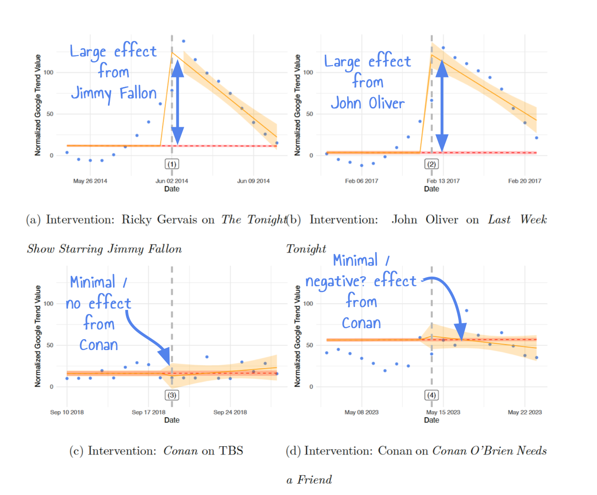

# Conan O'Brien needs a trending topic

On a recent episode of CONAF Sona expressed concern that Conan was dredging up the Richard Gere gerbil rumor. 
To test this hypothesis we scraped Google Trends data to examine whether there was a noticeable change after his mention. 
Interestingly, we see don't see an impact! Is this just because it is a podcast? Would mentioning it on his talk show have had an effect? Looks like no! 
We also look at the impact of Conan mentioning this rumor in a monologue on CONAN in 2018. Is this because it is impossible to observe an effect? Nope! 
We look at two other dates, once when the rumor was mentioned in Jimmy Fallon and once when it was mentioned by John Oliver, both had a significant effect on public discourse (as defined by Google Trends data). 
We think this is kind of funny. We've written up the results in all their glory in a manuscript. We have also created slides to present these to anyone who might find them informative along with a video tutorial, linked below.

* You can find the manuscript here [[link](https://github.com/LucyMcGowan/conan-obrien-needs-a-trending-topic/blob/main/manuscript.pdf)]
* You can find slides here [[link](https://docs.google.com/presentation/d/1ukhaM5dIkkzgUYM2hmjq7dqso69R2vB7s908waBCIEg/)]
* You can find a little tutorial on how to deliver the slides here [[link](https://www.youtube.com/watch?v=wFItys5Dqmk)]

Here is a visual summary of the findings.

